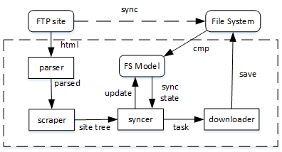

# online tools:
 - [Online JSON to Tree Diagram Converter](https://vanya.jp.net/vtree/)
 - [JSON Schema Tool](https://www.jsonschema.net/)

# scheme:
 - 

# run:
 -

    # start worker in a seperate window
    celery worker -A worker -Q download -c 3 -l info --without-gossip --without-mingle --pool=solo --purge

    # syncer:
    python run.py
